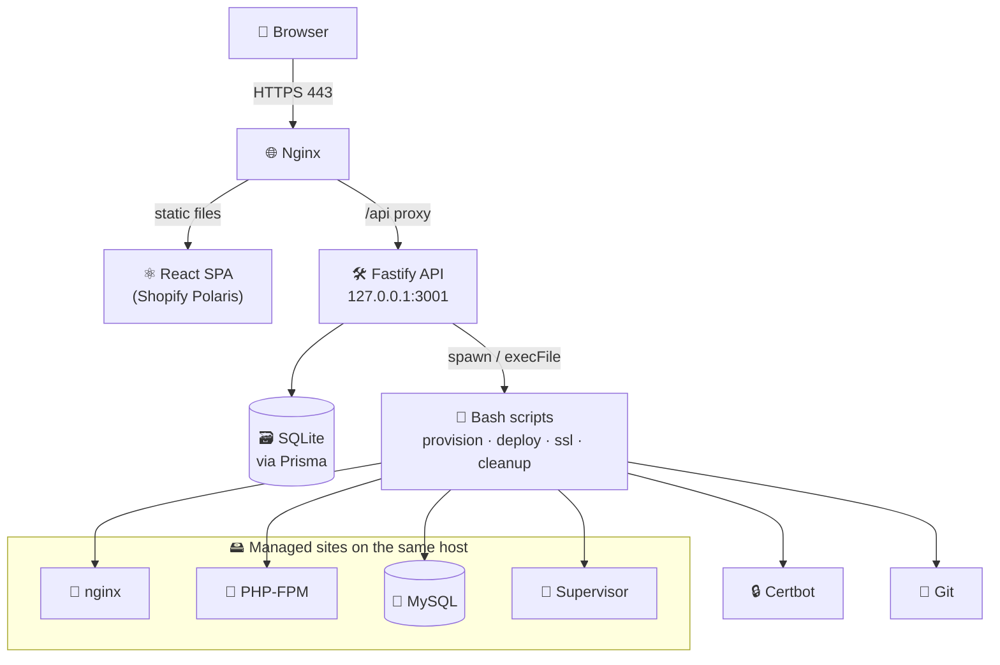

<div align="center">

# 🚀 Orchestrator

### Self-hosted server control panel for PHP / Laravel applications

*Provision, deploy, secure and monitor your sites — all from one dashboard, on your own droplet.*
*A lightweight, open alternative to Ploi, RunCloud & Laravel Forge.*

<br/>

[](https://www.typescriptlang.org/)
[](https://nodejs.org/)
[](https://fastify.dev/)
[](https://react.dev/)
[](https://www.prisma.io/)
[](https://vitejs.dev/)
[](LICENSE)
[](#-contributing)

</div>

---

## 📖 Table of Contents

- [✨ Overview](#-overview)
- [🎯 Features](#-features)
- [🏗️ Architecture](#️-architecture)
- [🧰 Tech Stack](#-tech-stack)
- [✅ Requirements](#-requirements)
- [⚡ Quick Start](#-quick-start)
- [🛠️ Production Installation](#️-production-installation)
- [⚙️ Configuration](#️-configuration)
- [🔒 Security](#-security)
- [📂 Project Structure](#-project-structure)
- [📜 Server Scripts](#-server-scripts)
- [🗺️ Roadmap](#️-roadmap)
- [🤝 Contributing](#-contributing)
- [📄 License](#-license)

---

## ✨ Overview

**Orchestrator** is a self-hosted control panel that runs **on the same server it manages**. It gives you a clean web dashboard to spin up new PHP/Laravel sites, deploy them straight from Git with zero downtime, issue SSL certificates, manage databases, tail logs, run background workers, and keep an eye on server health — without ever touching the command line.

Under the hood it is a small **pnpm monorepo**: a **Fastify + Prisma** API that orchestrates the host (`nginx`, `certbot`, `mysql`, `systemctl`, `supervisorctl`, Git), and a **React + Shopify Polaris** single-page dashboard served as static files by nginx.

> 💡 **Who is it for?** Developers and small teams who host a handful of Laravel/PHP apps on a single VPS (e.g. a DigitalOcean droplet) and want Forge-style convenience without a monthly subscription.

---

## 🎯 Features

<table>
<tr>
<td width="50%" valign="top">

### 🚢 Deployment
- ⚡ **Zero-downtime deploys** via atomic symlink swaps
- 🔀 Deploy any branch, straight from a Git repo
- 🔐 Private repos via encrypted access tokens
- 🪝 **GitHub webhooks** — auto-deploy on push (HMAC-verified)
- 🧪 **Deploy-time test gate** — run PHP tests before going live (block/warn, isolated SQLite)
- 📊 **Test analytics** — pass rate, duration & pass/fail trend per site
- 🩺 Post-deploy **health checks** with **auto-rollback**
- 🧩 Custom **pre / post-deploy hooks**
- 📜 Live streaming deploy logs (SSE)
- 🔔 **Rich deploy notifications** — Slack, Discord, Telegram, email & webhook, with commit message, author, duration & test counts

### 🗄️ Databases
- ➕ Create & manage MySQL databases/users per site
- 📥 Import `.sql` / `.sql.gz` dumps
- 💾 **Scheduled backups** (cron) + **one-click restore** + S3/R2 sync
- 🔑 One-click **phpMyAdmin SSO** (passwordless)
- 🧪 Built-in SQL runner (read/DML, DDL blocked)

### 📊 Monitoring
- 🐞 **Log Intelligence (mini-Sentry)** — Laravel errors mined & grouped by type with counts, first/last seen, search & resolve, linked to the deploy that likely introduced them
- 📈 **Performance insights (APM)** — response-time p50/p95/p99 + uptime % per site (slowest first)
- 🌍 **Public status pages** — shareable per-site uptime page (90-day history + incidents)
- 🧵 **Queue dashboard** — pending size, failing-by-class breakdown, bulk retry/flush
- 📨 **Weekly digest** — a once-a-week health summary to your channels
- 🔔 **Notification center + threshold alerts** — bell feed for deploys & alerts; raise CPU/RAM/disk/swap rules that fan out to your channels
- 🎛️ **Customizable dashboard** — drag to reorder, resize, show/hide widgets & save per-user presets
- 📈 CPU, RAM, disk & swap in real time
- 📉 **Historical resource charts** (6h / 24h / 7d)
- 🔥 **Top services by resource use** — processes grouped & ranked by CPU / memory
- 🟢 Service status (nginx, MySQL, Redis, PHP-FPM…)
- ⏱️ **Uptime monitoring** with history
- 🧾 Live log viewer & failed-jobs inspector

</td>
<td width="50%" valign="top">

### 🖥️ Server Management
- 🌐 Provision sites (dirs, nginx vhost, DB, user)
- 🧱 **Stack templates** — Laravel / WordPress / static (tailored nginx vhost)
- ☁️ **Cloudflare DNS** — auto-create the A record on provision
- 🔒 **Let's Encrypt SSL** via Certbot (one click)
- ⏰ **SSL expiry alerts** (14/7/3/1-day) + dashboard "expiring soon" badge
- ✏️ In-browser **nginx & `.env` editors** (with backup + validation)
- 🐘 Per-site **PHP version** switching
- 👷 **Supervisor** queue workers
- 🧰 **Composer** & **Artisan** command runners
- 🗂️ Full **file manager** (edit, upload, zip, chmod…)
- 💻 In-browser **web terminal** (xterm.js)
- 🚧 Maintenance mode & scheduled tasks (cron)
- 🧰 **System control** — apt update/upgrade, cleanup, ufw firewall & reboot from the UI (admin)
- ☁️ **S3 / R2** off-site backups

### 🔐 Security & Access
- 🔑 JWT auth + **2FA (TOTP)**
- 👥 **RBAC**: admin / developer / viewer
- 🎯 **Per-site** access grants
- 🧾 Full **audit log** of privileged actions
- 🔒 **Secrets encrypted at rest** (AES-256-GCM)
- 🔑 **Personal Access Tokens** — scriptable panel API for CI/curl (hashed, scoped to your role, revocable)
- 🛡️ **Per-site security** — HTTP basic auth + IP allow/deny, applied to nginx with backup + validate + auto-rollback

### 🖥️ Infrastructure
- 🌐 **Multi-server (SSH, agentless)** — register additional servers and run sites on them from one panel, with **full feature parity**: provision, deploy/rollback, .env/nginx/PHP config, Laravel logs & error intelligence, artisan/composer/queue/maintenance, workers/PHP-FPM/scheduler, SSL (certbot), database backup/restore, file manager and web terminal all operate on the site's own server. The panel host is the always-present "local" server; remote servers are reached over SSH with a key you provide (encrypted at rest; trust-on-first-use host keys). Existing sites stay local and are **completely unaffected**: `serverId=null` resolves to the local server, so their execution path is byte-for-byte unchanged. To add one: **Infrastructure → Add server** (host, SSH user, private key) → Test connection → **Prepare** → then pick it as the target when adding a new site. The matching public key must be in the remote's `~/.ssh/authorized_keys`. *(phpMyAdmin bridge & advanced DB-user management remain local-only; use Backups or the web terminal on remote servers.)*
- 🧱 **One-click "Prepare server"** — bootstrap a clean Ubuntu host with the whole stack: PHP 8.1–8.5 (fpm+cli) with every Laravel/Filament extension (intl, gd, bcmath, redis, soap…), nginx, MariaDB, Composer, Node.js 20 (front-end asset builds), Supervisor, Certbot, Redis, and `/var/www/sites` + firewall — streamed live, idempotent, unreleased PHP versions skipped gracefully

### 💰 Billing & dunning
- 🧾 **Client billing** — clients, per-site subscriptions each on **their own monthly anchor day** (1–28), sequential immutable invoices, partial payments, cash/bank/card. All money is stored as integer minor units (tetri/cents), never floats.
- 🪜 **Graduated dunning ladder** instead of a binary on/off switch. Relative to an invoice's due date: `-7d` reminder → `0d` due notice → `+4d` overdue banner injected into the site → `+7d` `/admin` + `/login` blocked (public site stays up) → `+10d` branded suspension page → `+30d` queue workers stopped → `+60d` final warning → `+90d` archive. **Nothing is ever auto-deleted.** Every rung is configurable per plan or per subscription.
- 🛑 **Safety first.** A master switch (`off` / `dry_run` / `on`) defaults to **off** and fails closed — billing can never suspend a site by accident. A `neverAutoSuspend` (VIP) subscription is hard-capped at the banner rung. Enforcement never runs mid-deploy, is idempotent, is reversed the instant an invoice is marked paid, **never touches the database**, and is applied through the same backup → `nginx -t` → auto-rollback guard as per-site security.
- 🔎 **"What happens next" preview** and a dry-run of the daily tick, so an automatic suspension is never a surprise.
- 🌐 **SEO-safe suspension page** — returns `503 + Retry-After` (not 402/404) so search engines treat it as temporary, keeps answering `/.well-known/acme-challenge/` so certbot renewals survive a suspension, and uses an internal-only status code so the app's *own* 503 (`artisan down`) is never hijacked. Georgian/English, shows the amount due.
- 💬 **Telegram-native** — `/invoices`, `/overdue`, `/paid <id|number>` run through the bot's existing permission-aware router (a non-admin just gets a 403). Reminders also fan out to email/Slack/Discord/webhook.
- 🔗 **Read-only client portal** at `/client/<token>` (no login, same token pattern as status pages): the client sees their sites, invoices and balance — but can never mark anything paid.
- 📊 **Infrastructure-aware profitability** — joins what each client pays with how crowded their server is, surfacing the under-priced site that should be re-priced or moved to its own droplet.
- 🏦 Bank-statement reconciliation and payment gateways are not implemented, but the `Payment` model is already shaped for them (`method` / `source` / `reference` / unique `externalId` for idempotent imports).

### 🧠 Productivity
- ✨ **AI assistant** — explains errors, diagnoses failed deploys, and answers free-form ops questions in a chat page (optionally grounded in a site's live status + recent errors). Bring-your-own-key, secrets redacted, read-only/advisory; supports OpenAI-compatible & Anthropic (incl. local models like Ollama), with a configurable daily request limit, usage counter and one-click connection test
- 📱 **Interactive Telegram bot** — manage sites, deploys, rollbacks & tasks from chat, with your own role/site permissions
- 🔎 **Search, sort & tag-filter** across your sites
- 🗂️ Kanban **task board** · 📝 Notes · 📅 Calendar
- 🌊 **DigitalOcean** droplet controls
- 📱 **Installable PWA** — add to home screen, works on mobile

</td>
</tr>
</table>

---

## 🏗️ Architecture



The API **listens only on `127.0.0.1`** and is always reached through the local nginx reverse proxy — it is never exposed directly to the internet.

---

## 🧰 Tech Stack

| Layer | Technologies |
|-------|-------------|
| **Backend** | Node.js · TypeScript · [Fastify](https://fastify.dev/) · [Prisma ORM](https://www.prisma.io/) · SQLite |
| **Auth & Security** | `@fastify/jwt` · `bcryptjs` · `speakeasy` (TOTP) · `@fastify/rate-limit` · AES-256-GCM |
| **Frontend** | React 18 · [Vite](https://vitejs.dev/) · [Shopify Polaris](https://polaris.shopify.com/) · React Router · Recharts |
| **Terminals & Files** | `node-pty` · `@xterm/xterm` · `@monaco-editor/react` |
| **Integrations** | `mysql2` · `@aws-sdk/client-s3` · `nodemailer` · DigitalOcean API |
| **Infra targets** | Ubuntu/Debian · Nginx · PHP-FPM · MySQL · Certbot · Supervisor · Redis |

---

## ✅ Requirements

**Server (Ubuntu 22.04 / 24.04 LTS recommended):**

- 🖥️ **2 GB RAM / 2 vCPU** minimum (4 GB recommended for multiple sites + queue workers)
- 💾 50 GB+ SSD
- 🟢 **Node.js ≥ 20** & [`pnpm`](https://pnpm.io/)
- 🐘 PHP-FPM (`ondrej/php` PPA for multiple versions) · 🐬 MySQL · 🎼 Composer
- 🌐 Nginx · 🔒 Certbot · 👷 Supervisor · 🌱 Git · 🔴 Redis (optional)

**Local development:**

- Node.js ≥ 20, pnpm, and a Unix-like shell.

---

## ⚡ Quick Start

> For local development. See [Production Installation](#️-production-installation) for a real server.

```bash
# 1. Clone
git clone https://github.com/thesaba/orchestrator.git
cd orchestrator

# 2. Install all workspace dependencies
pnpm install

# 3. Configure the API
cd apps/api
cp .env.example .env          # then edit JWT_SECRET / ENCRYPTION_KEY

# 4. Set up the database + seed the first admin
pnpm exec prisma generate
pnpm exec prisma db push
pnpm db:seed                  # ⚠️ prints the generated admin password — save it!

# 5. Run API + Web together (from repo root)
cd ../..
pnpm dev
```

- 🔌 API → `http://localhost:3001`
- 🖥️ Dashboard → `http://localhost:3000`
- 👤 Default login → **`admin@localhost`** + the password printed by `pnpm db:seed`

---

## 🛠️ Production Installation

<details>
<summary><b>Click to expand the full server setup guide</b></summary>

<br/>

**1️⃣ Base directory & code**

```bash
sudo mkdir -p /opt/orchestrator
sudo chown $USER:$USER /opt/orchestrator
git clone https://github.com/thesaba/orchestrator.git /opt/orchestrator
cd /opt/orchestrator
pnpm install --frozen-lockfile
```

**2️⃣ Configure the API** (`/opt/orchestrator/apps/api/.env`)

```ini
DATABASE_URL="file:./prod.db"
JWT_SECRET="<a long random string>"
ENCRYPTION_KEY="<a different long random string>"
PORT=3001
CORS_ORIGIN="https://deploy.yourdomain.com"
SCRIPTS_DIR="/opt/orchestrator/scripts"
```

> Generate a secret with: `node -e "console.log(require('crypto').randomBytes(32).toString('hex'))"`

**3️⃣ Build & seed**

```bash
cd /opt/orchestrator/apps/api
pnpm exec prisma generate
pnpm exec prisma db push
pnpm db:seed            # save the printed admin password
pnpm build              # -> dist/

cd /opt/orchestrator/apps/web
pnpm build              # -> dist/  (served by nginx)
```

**4️⃣ Run the API as a service**

```bash
sudo cp /opt/orchestrator/scripts/orchestrator-api.service /etc/systemd/system/
sudo systemctl daemon-reload
sudo systemctl enable --now orchestrator-api
journalctl -u orchestrator-api -f
```

**5️⃣ Configure Nginx**

```bash
sudo cp /opt/orchestrator/scripts/nginx-panel.conf /etc/nginx/sites-available/orchestrator
sudo sed -i 's/PANEL_DOMAIN/deploy.yourdomain.com/g' /etc/nginx/sites-available/orchestrator
sudo ln -s /etc/nginx/sites-available/orchestrator /etc/nginx/sites-enabled/
sudo nginx -t && sudo systemctl reload nginx
```

**6️⃣ Enable HTTPS**

```bash
sudo certbot --nginx -d deploy.yourdomain.com
```

**7️⃣ Log in** at `https://deploy.yourdomain.com` and immediately:
- 🔑 change the admin password (Settings)
- 📱 enable 2FA
- 🐬 add your MySQL root credentials (Settings) to enable database provisioning

> ⚙️ Because Orchestrator runs privileged commands (`systemctl`, `nginx`, `certbot`, `mysql`…), the service user needs permission to run them. The simplest model runs the agent with elevated privileges; a hardened least-privilege setup with narrow `sudoers` rules is recommended for production.

**System Control page (optional).** The admin-only **System** page runs package, cleanup, firewall and reboot actions via passwordless `sudo`. Grant them to the service user (e.g. `deployer`) in `/etc/sudoers.d/orchestrator-system`:

```
deployer ALL=(root) NOPASSWD: /usr/bin/apt-get, /usr/bin/journalctl, /usr/sbin/ufw, /sbin/reboot, /usr/sbin/reboot
```

Without this, System-page actions fail with "a password is required". Commands are a fixed allowlist and the page is admin-only, but review the security tradeoff before enabling.

</details>

---

## ⚙️ Configuration

All backend configuration is via environment variables in `apps/api/.env`.

| Variable | Required | Default | Description |
|----------|:--------:|---------|-------------|
| `DATABASE_URL` | ✅ | `file:./dev.db` | Prisma SQLite database path |
| `JWT_SECRET` | ✅ | — | Secret for signing JWTs. **Refuses to start without it.** |
| `ENCRYPTION_KEY` | ⭐ | `JWT_SECRET` | Key for encrypting secrets at rest. Set a dedicated one in production. |
| `PORT` | — | `3001` | API port (bound to `127.0.0.1`) |
| `CORS_ORIGIN` | — | `http://localhost:3000` | Allowed dashboard origin |
| `SCRIPTS_DIR` | — | `../../scripts` | Path to the bash scripts directory |
| `JWT_EXPIRES_IN` | — | `24h` | Session token lifetime |
| `RATE_LIMIT_MAX` | — | `600` | Global requests/min per client IP |
| `DEPLOY_TIMEOUT_MS` | — | — | Max deploy duration before the watchdog kills it |
| `PMA_BASE_URL` · `PMA_BRIDGE_SECRET` | — | — | phpMyAdmin SSO bridge (optional) |
| `SMTP_HOST` · `SMTP_PORT` · `SMTP_SECURE` · `SMTP_USER` · `SMTP_PASS` · `SMTP_FROM` | — | — | Email alerts on deploy events (optional) |

> ⭐ **`ENCRYPTION_KEY` note:** if you already store encrypted Git tokens, do **not** change this value later — existing ciphertext would become undecryptable. Leave it unset (falls back to `JWT_SECRET`) or set it once, up front.

---

## 🔒 Security

Orchestrator controls the whole host, so security is treated as a first-class concern:

- 🛡️ **Shell-injection-safe** — user/DB-derived values never reach a shell via string interpolation; commands run through `execFile` (argv, no shell) or native Node `fs` APIs.
- 🔐 **Secrets encrypted at rest** — MySQL root password, S3/R2 keys, DigitalOcean token, per-site DB passwords, Git tokens and TOTP secrets are stored with **AES-256-GCM**.
- 🔑 **Strong auth** — bcrypt password hashing (cost 12), optional **TOTP 2FA**, short-lived JWTs.
- 👥 **Granular RBAC** — `admin` / `developer` / `viewer` roles plus **per-site** access grants, enforced on every route.
- 🚦 **Rate limiting** — strict on login (10 / 15 min) plus a global per-IP backstop.
- 🧾 **Audit logging** — every privileged action (deploys, terminal sessions, config changes) is recorded.
- 🕵️ **Least exposure** — API bound to loopback; internal endpoints blocked at the proxy; correct client IPs via trusted-proxy handling.

> 🔎 Found a vulnerability? Please open a **private** security advisory rather than a public issue.

---

## 📂 Project Structure

```
orchestrator/
├── apps/
│   ├── api/                    # Fastify + Prisma backend
│   │   ├── prisma/             # schema.prisma, seed
│   │   └── src/
│   │       ├── plugins/        # auth (JWT), rbac, audit, prisma
│   │       ├── lib/            # crypto, exec, digitalocean, notify…
│   │       ├── routes/         # sites, deploy, ssl, database, filemanager…
│   │       └── index.ts        # app bootstrap
│   └── web/                    # React + Vite + Polaris dashboard
│       └── src/                # pages, components, context, api client
├── scripts/                    # Bash automation run by the API
├── pnpm-workspace.yaml
└── README.md
```

---

## 📜 Server Scripts

Located in `scripts/`, invoked by the API to act on the host:

| Script | Purpose |
|--------|---------|
| `provision.sh` | Create site dir, MySQL database/user, nginx vhost |
| `deploy.sh` | Zero-downtime deploy (clone → composer → build → migrate → hand ownership to `www-data` → symlink swap) |
| `ssl.sh` | Issue a Let's Encrypt certificate via Certbot |
| `cleanup.sh` | Fully remove a site (files, nginx, DB, supervisor) |
| `rename-domain.sh` | Rename a site's domain on disk + nginx |
| `toggle-site.sh` | Enable/disable serving a site |
| `backup.sh` | Cron-based MySQL dump backups (per site) |
| `panel-backup.sh` | Back up the panel's **own** SQLite database (WAL-safe) |
| `orchestrator-api.service` · `nginx-panel.conf` | systemd & nginx templates |
| `orchestrator-backup.service` · `.timer` | Daily panel-DB backup via systemd |

---

## 🗺️ Roadmap

- [ ] 🔓 Least-privilege runtime (dedicated user + narrow `sudoers`)
- [ ] ♻️ Token revocation + `HttpOnly` cookie sessions
- [ ] 🪝 Separate webhook identifier from HMAC secret
- [ ] 🐳 Docker-based deploy targets
- [x] 🧪 Unit tests for crypto / validation / alerts (expanding coverage)

---

## 🤝 Contributing

Contributions are welcome! 🎉

1. 🍴 Fork the repository
2. 🌱 Create a feature branch — `git checkout -b feat/amazing-thing`
3. ✅ Commit your changes — `git commit -m "feat: add amazing thing"`
4. 🚀 Push and open a Pull Request

Please keep PRs focused, follow the existing code style, and before submitting:

```bash
pnpm --filter api build   # type-check the backend
pnpm --filter api test    # run the unit tests (node:test via tsx)
pnpm --filter web build   # type-check + build the frontend
```

---

## 📄 License

Distributed under the **MIT License** — see [`LICENSE`](LICENSE) for details.

Copyright © 2026 [**@thesaba**](https://github.com/thesaba).

---

<div align="center">

**⭐ If Orchestrator saves you time, consider starring the repo! ⭐**

Made with ❤️ and TypeScript

</div>
